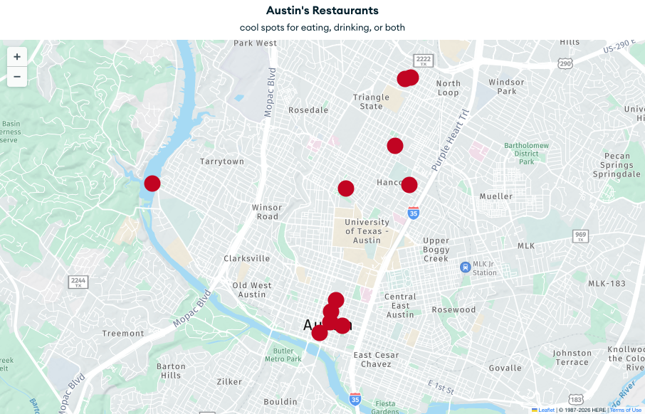

### Collection: `restaurants`

```javascript

// Document 1: Clay Pit (Downtown - Guadalupe)
{
  _id: ObjectId("64a1f2b3c4d5e6f7a8b9c0d2"),
  name: "Clay Pit",
  description: "Upscale Indian cuisine featuring...",
  cuisine: "Indian",
  rating: 4.5,
  priceRange: "$$$",
  tags: ["indian", "tandoori", "curry", "fine-dining", "historic", "vegetarian-options"],

  location: {
    type: "Point",
    coordinates: [-97.742130, 30.270150]
  },

  address: {
    street: "1601 Guadalupe Street",
    city: "Austin",
    state: "TX",
    zip: "78701"
  },

  hours: { ...  }
}

// Document 2: Pinthouse Pizza (Burnet Road)
{
  _id: ObjectId("64a1f2b3c4d5e6f7a8b9c0d1"),
  name: "Pinthouse Pizza",
  description: "Craft beer brewery and artisan pizzas...",
  cuisine: "Pizza",
  rating: 4.7,
  priceRange: "$$",
  tags: ["pizza", "craft-beer", "brewery", "family-friendly", "outdoor seating"],

  location: {
    type: "Point",
    coordinates: [-97.738530, 30.295840]
  },

  address: {
    street: "4729 Burnet Road",
    city: "Austin",
    state: "TX",
    zip: "78756"
  },

  hours: { ...  }
}
